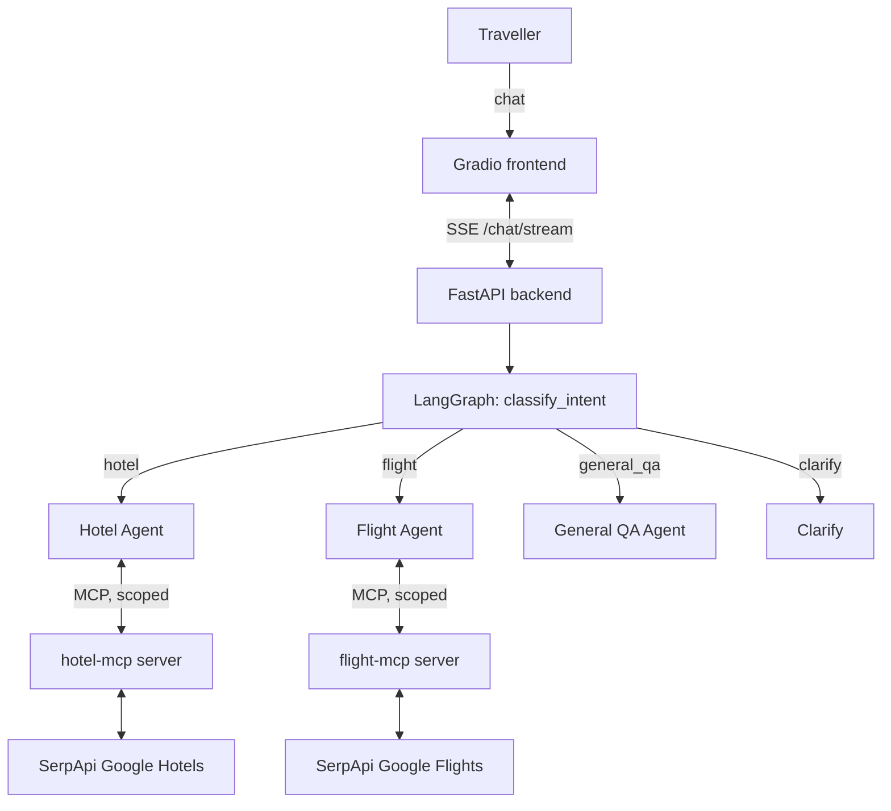

# TripWeaver ✈️

An MCP-based, intent-routed multi-agent travel planner. A traveller chats
naturally; a LangGraph workflow routes to a General QA, Hotel, or Flight
agent; each specialist reaches real external data (SerpApi) exclusively
through its own MCP server. Built for the *MCP-Based Multi-Agent Travel
Planner* Extension Sprint spec.

- **Architecture & every locked design decision:** [`SYSTEM.md`](./SYSTEM.md)
- **Security model & threat table:** [`SECURITY.md`](./SECURITY.md)
- **MCP server setup (SerpApi key, local run, deploy):** [`MCP_SETUP.md`](./MCP_SETUP.md)

## Architecture



Three independently deployable processes: **frontend** (Gradio), **backend**
(FastAPI + LangGraph), **MCP servers** (`hotel-mcp`, `flight-mcp`). Agents
never call SerpApi directly - only through their own server's MCP tools -
so adding or swapping a travel data provider never touches agent code.

## Features

**Core (spec-required)**
- Intent-routed LangGraph workflow (not a fixed linear path)
- Real external data via MCP: Google Hotels + Google Flights search through SerpApi
- Streaming responses, token-by-token, over SSE
- Agent-activity visualisation (ROUTING / SEARCHING / BOOKING / RESPONDING
  / CLARIFYING - a "departure board" ticker in the UI)
- Graceful degradation: a dead MCP server never crashes the app
- Follow-up questions for missing input, never guessed values
- Travel-themed, responsive Gradio UI

**Added on top**
- **Security**: API-key auth, per-identity rate limiting, three-layer input
  validation, unguessable session ids, locked-down CORS (see `SECURITY.md`)
- **Prompt-injection defence**: MCP tool results are fenced as untrusted
  data and the model is explicitly told not to follow instructions
  embedded in them
- **Guardrails**: hard cap on tool-call rounds per turn, conversation
  history trimming, result-count caps - all to keep cost and latency bounded
- **Memory**: LangGraph `MemorySaver` gives free cross-turn context per
  session ("make it cheaper" works without repeating the city and dates)
- **UX**: quick-reply chips, copyable messages, a "New trip" reset, retry-
  friendly error messages instead of stack traces
- **Tests**: 69 offline tests (37 backend + 32 provider contracts) covering
  routing, graceful degradation, tool-loop caps, SerpApi request mapping,
  normalization, validation, and secret redaction (no API keys needed in CI)

## Repository layout

```
backend/
  main.py                 FastAPI app: /health, /session, /chat/stream (SSE)
  agents/
    entity.py              Shared LangGraph state schema
    llm.py                 LLM factory (OpenAI)
    prompts.py              System prompts + shared guardrails block
    mcp_client.py            Resilient, per-server-scoped MCP tool loading
    nodes.py                classify_intent / hotel / flight / general_qa / clarify
    graph.py                 StateGraph wiring + MemorySaver checkpointer
  core/security.py          Auth, rate limiting, input & session-id validation
  tests/                    pytest suite (mocked LLM/tools, no network needed)
mcp_servers/
  hotel_mcp/                 list_hotels / search_hotels / book_hotel
  flight_mcp/                 list_flights / search_flights / book_flight
frontend/
  app.py                     Gradio Blocks UI, SSE client
  theme.py                   Colors, fonts, activity-ticker CSS
docker-compose.yml            Run all four services together, locally
SYSTEM.md / SECURITY.md / MCP_SETUP.md
```

## Quickstart (local)

```bash
git clone <your-repo-url> tripweaver && cd tripweaver

# 1. MCP servers (see MCP_SETUP.md for configuring a private SerpApi key)
cd mcp_servers/hotel_mcp  && cp .env.example .env && pip install -r requirements.txt && python server.py &
cd ../flight_mcp           && cp .env.example .env && pip install -r requirements.txt && python server.py &

# 2. Backend
cd ../../backend
cp .env.example .env   # add OPENAI_API_KEY, set TRIPWEAVER_API_KEYS
pip install -r requirements.txt
uvicorn main:app --reload

# 3. Frontend
cd ../frontend
cp .env.example .env   # BACKEND_API_KEY must match one value in TRIPWEAVER_API_KEYS
pip install -r requirements.txt
python app.py
```

Open http://localhost:7860. Or simply: `docker compose up --build`.

## Deploying

Deploy in this order - each step needs the previous step's URL:

1. **`mcp_servers/hotel_mcp`** and **`mcp_servers/flight_mcp`** to Railway
   (one service each, root directory set per service). Full steps in
   `MCP_SETUP.md` section 8.
2. **`backend`** to Railway, root directory `backend`. Set
   `HOTEL_MCP_URL` / `FLIGHT_MCP_URL` to the two URLs from step 1,
   `OPENAI_API_KEY`, `TRIPWEAVER_API_KEYS` (generate a long random string),
   and `ALLOWED_ORIGINS` (you'll fill this in after step 3, then redeploy).
3. **`frontend`** to Hugging Face Spaces, root = `frontend/`. Set
   `BACKEND_URL` to the backend's Railway URL and `BACKEND_API_KEY` to one
   of the values in `TRIPWEAVER_API_KEYS`.
4. Go back to the backend's Railway variables and set `ALLOWED_ORIGINS` to
   your Space's URL, then redeploy the backend so CORS actually allows it.

## Testing

```powershell
.\.venv\Scripts\python.exe -m pytest -q
```

69 tests pass offline: 37 backend tests mock LLM/MCP behavior, and 32 provider
tests use `httpx.MockTransport` so they consume no SerpApi credits. They cover
routing, graceful degradation, tool-loop caps, provider request mapping,
normalization, validation, and credential-safe failures. Every Python file is
also compile-checked against the installed dependency versions.

## Viva quick-reference

See `SYSTEM.md` for the full design rationale. Fast pointers into the code
for the questions SRS section 11 says to expect:

- **MCP layer / decoupling** -> `agents/mcp_client.py` (`get_tools_for`),
  `MCP_SETUP.md` section 9
- **Intent routing / state** -> `agents/graph.py`, `agents/entity.py`
- **Missing-input handling** -> `agents/prompts.py` (agent rules 1),
  `clarify_node` in `agents/nodes.py`
- **External-failure handling** -> `agents/mcp_client.py` (circuit breaker),
  `_run_specialist`'s try/except in `agents/nodes.py`
- **Streaming / activity cues** -> `main.py`'s `astream_events` bridge,
  `frontend/app.py`'s SSE consumer
- **Security** -> `SECURITY.md`
