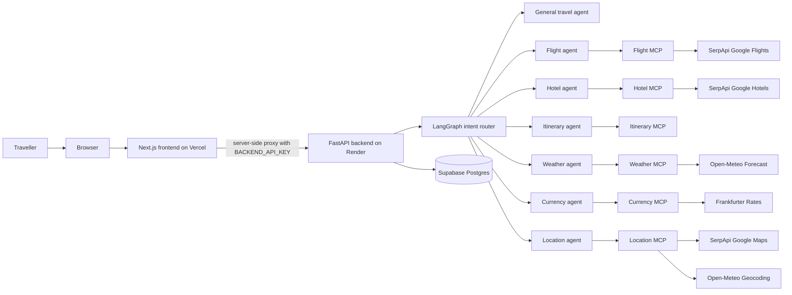
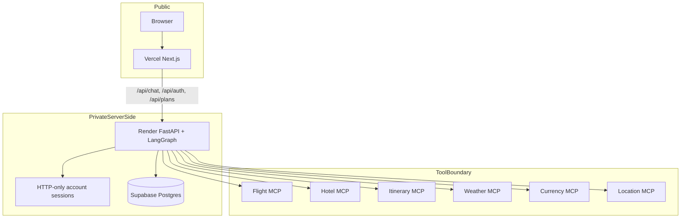
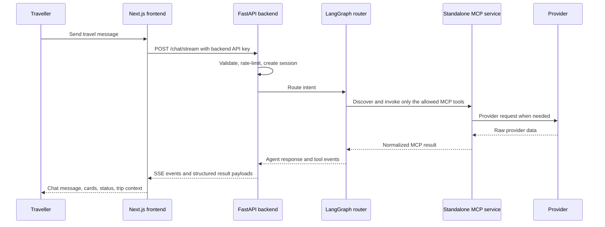
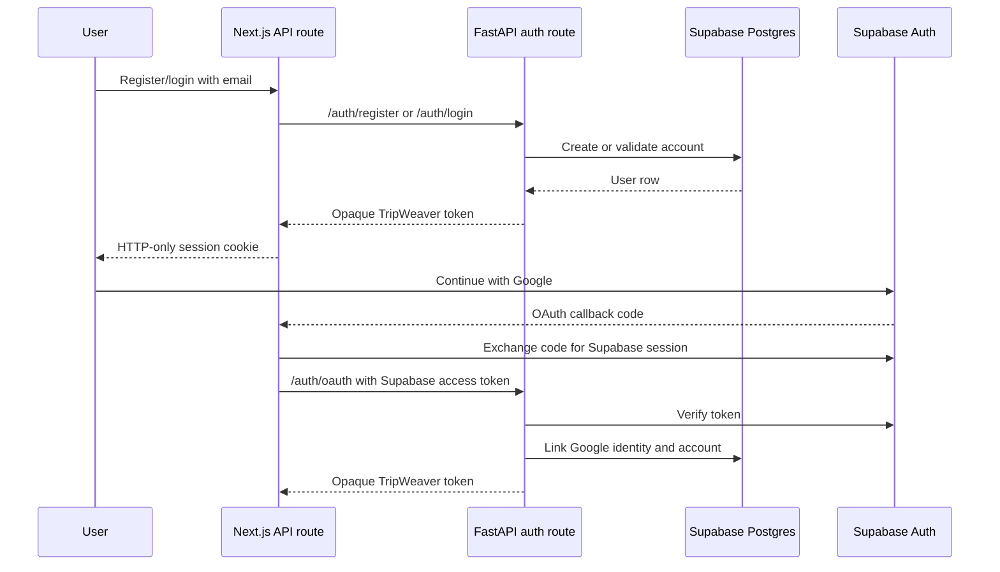

# TripWeaver

TripWeaver is a production-shaped, MCP-based multi-agent travel planner. It combines a polished responsive Next.js interface with a FastAPI + LangGraph backend that routes each travel request to a specialist agent with only the tools it is allowed to use.

The system supports account-scoped chat history, plan folders, live tool status, structured travel results, guided planning questions, and provider-backed travel research through isolated MCP/tool adapters.

## Live Deployment

| Layer | URL |
| --- | --- |
| Frontend | https://multi-agent-travel-planner-jet.vercel.app/ |
| Backend | https://tripweaver-backend-9fz2.onrender.com |
| Backend health | https://tripweaver-backend-9fz2.onrender.com/health |
| Frontend health proxy | https://multi-agent-travel-planner-jet.vercel.app/api/health |
| Supabase project | https://zkxzsnudgzsdqlvvinbi.supabase.co |
| Repository | https://github.com/AmiruMallawarachchi/multi-agent-travel-planner |

Demo note: Render Free can sleep after inactivity. If the first request is slow or auth briefly appears unavailable, open the backend health URL once and retry after the service wakes.

## What Makes It Strong

- Intent-routed LangGraph orchestration with separate specialist agents.
- Least-privilege tool binding: flight agents cannot call hotel tools, weather agents cannot call currency tools, and so on.
- Six standalone FastMCP services discovered over streamable HTTP in the deployed runtime.
- Server-side API proxying so browser users never receive OpenAI, SerpApi, database, or backend API secrets.
- Account-backed history and plan folders with per-user isolation.
- Structured result rendering for flights, hotels, itineraries, weather, currency, and locations.
- User-safe error handling for backend, provider, and auth failures.
- Offline tests for backend contracts, frontend behavior, SSE parsing, auth flows, and provider normalization.

## Architecture At A Glance



## Production Topology



The Render Blueprint deploys every MCP capability as an independent web service.
The backend uses `MultiServerMCPClient` with streamable HTTP and does not bundle
provider adapters in its production image. `TRIPWEAVER_TOOL_MODE=local` remains
available only as an explicit local-development fallback.

## Request Lifecycle



## Authentication And History



TripWeaver does not expose database credentials, backend API keys, or account tokens to the browser bundle. The frontend stores the TripWeaver account token only in an HTTP-only cookie.

## Capabilities

| Capability | Agent/tool owner | Provider |
| --- | --- | --- |
| Flights | `flight` agent, flight tools | SerpApi Google Flights |
| Hotels | `hotel` agent, hotel tools | SerpApi Google Hotels |
| Itinerary | `itinerary` agent, deterministic planner | Local/domain logic plus places |
| Weather | `weather` agent, weather tools | Open-Meteo |
| Currency | `currency` agent, currency tools | Frankfurter |
| Location/places | `location` agent, location tools | Open-Meteo + SerpApi Google Maps |
| General travel help | `general_qa` agent | OpenAI model only |

Booking actions are simulated by design. TripWeaver never purchases, books, pays for, cancels, or changes real travel.

## Repository Layout

```text
backend/
  agents/                 LangGraph graph, intent routing, prompts, specialist runners
  api/                    FastAPI routes, schemas, health, auth, SSE normalization
  core/                   API-key auth, account storage, Supabase token validation, rate limits
  tests/                  backend tests and API contract checks

frontend/
  app/                    Next.js App Router pages and server-side API proxies
  components/             shadcn/ui components and TripWeaver workspace
  features/tripweaver/    conversation state, stream reducer, typed travel models
  lib/                    shared HTTP and Supabase helpers

mcp_servers/
  flight_mcp/             SerpApi Google Flights adapter
  hotel_mcp/              SerpApi Google Hotels adapter
  itinerary_mcp/          deterministic itinerary service
  weather_mcp/            Open-Meteo weather service
  currency_mcp/           Frankfurter currency service
  location_mcp/           geocoding and place-search service

deploy/render/            Render backend Dockerfile
.github/workflows/        Python, frontend, and container CI
SYSTEM.md                 implemented architecture and trust boundaries
BOOTCAMP_DEPLOYMENT.md    Vercel + Render + Supabase deployment guide
BOOTCAMP_CRITERIA.md      assessed requirements and evidence matrix
DEPLOYMENT.md             single-VM production deployment guide
```

## Environment Contract

### Render backend

```text
OPENAI_API_KEY=...
DATABASE_URL=postgresql://...
TRIPWEAVER_API_KEYS=one-long-random-secret
ALLOWED_ORIGINS=https://multi-agent-travel-planner-jet.vercel.app,http://localhost:3000
TRIPWEAVER_TOOL_MODE=mcp
HOTEL_MCP_HOST=tripweaver-hotel-mcp.onrender.com
FLIGHT_MCP_HOST=tripweaver-flight-mcp.onrender.com
ITINERARY_MCP_HOST=tripweaver-itinerary-mcp.onrender.com
WEATHER_MCP_HOST=tripweaver-weather-mcp.onrender.com
CURRENCY_MCP_HOST=tripweaver-currency-mcp.onrender.com
LOCATION_MCP_HOST=tripweaver-location-mcp.onrender.com
SUPABASE_URL=https://zkxzsnudgzsdqlvvinbi.supabase.co
SUPABASE_PUBLISHABLE_KEY=...
ROUTER_MODEL=gpt-4o-mini
AGENT_MODEL=gpt-4o-mini
RATE_LIMIT_REQUESTS=20
RATE_LIMIT_WINDOW_SECONDS=60
MAX_MESSAGE_LENGTH=2000
```

Render injects the six `*_MCP_HOST` values from the corresponding services in
`render.yaml`; they are listed here to make the runtime contract explicit.
`SERPAPI_API_KEY` belongs only to the hotel, flight, and location MCP services.

### Vercel frontend

```text
BACKEND_URL=https://tripweaver-backend-9fz2.onrender.com
BACKEND_API_KEY=same-value-as-one-render-TRIPWEAVER_API_KEYS-entry
NEXT_PUBLIC_SUPABASE_URL=https://zkxzsnudgzsdqlvvinbi.supabase.co
NEXT_PUBLIC_SUPABASE_PUBLISHABLE_KEY=...
```

### Supabase

Use Supabase for managed Postgres and optional Google identity verification.

Important:

- `DATABASE_URL` belongs only in Render.
- `DATABASE_URL` must not be committed, pasted into frontend env, or exposed in `NEXT_PUBLIC_` variables.
- If the database password contains special characters, use the Supabase-provided encoded URL or percent-encode the password.
- Do not include square brackets around the password. Use `password`, not `[password]`.
- If the database URL or password was ever pasted into chat, rotate the Supabase database password and update Render.

## Current Auth Issue Checklist

If the UI says the account service is temporarily unavailable while `/health` is green, the backend is alive but account persistence is failing.

Check these first:

1. Render `DATABASE_URL` is present.
2. Render `DATABASE_URL` starts with `postgresql://`.
3. The password in `DATABASE_URL` is URL encoded and has no square brackets.
4. Render was redeployed after editing environment variables.
5. Render logs do not show `DATABASE_URL is configured for Postgres but psycopg is not installed`.
6. Render logs do not show `could not translate host name`, `password authentication failed`, or `connection timeout`.
7. Vercel `BACKEND_API_KEY` exactly matches one value in Render `TRIPWEAVER_API_KEYS`.
8. Vercel `BACKEND_URL` is `https://tripweaver-backend-9fz2.onrender.com` with no path after it.
9. Supabase project is not paused.
10. Supabase connection string uses the Transaction Pooler or Session Pooler string recommended by the dashboard.

Expected backend health after this branch is deployed:

```json
{
  "status": "ok",
  "service": "tripweaver-backend",
  "mcp_servers": {
    "hotel-mcp": "available",
    "flight-mcp": "available",
    "itinerary-mcp": "available",
    "weather-mcp": "available",
    "currency-mcp": "available",
    "location-mcp": "available"
  },
  "account_storage": {
    "backend": "postgres",
    "status": "available"
  },
  "tool_runtime": {
    "mode": "mcp",
    "transport": "streamable_http",
    "configured_servers": 6
  }
}
```

If `account_storage.status` is `unavailable`, registration, login, Google login, account history, and plan folders cannot work until the Render database environment is fixed.

## Local Setup

### Backend

```powershell
python -m venv .venv
.\.venv\Scripts\Activate.ps1
python -m pip install -r backend\requirements.txt
python -m pip install -r backend\requirements-dev.txt
```

### Frontend

```powershell
npm ci --prefix frontend
```

### Environment files

```powershell
Copy-Item backend\.env.example backend\.env
Copy-Item frontend\.env.example frontend\.env
Copy-Item mcp_servers\hotel_mcp\.env.example mcp_servers\hotel_mcp\.env
Copy-Item mcp_servers\flight_mcp\.env.example mcp_servers\flight_mcp\.env
Copy-Item mcp_servers\location_mcp\.env.example mcp_servers\location_mcp\.env
```

Never commit real `.env` files.

### Run locally

```powershell
.\.venv\Scripts\python.exe -m uvicorn main:app --app-dir backend --port 8000
npm --prefix frontend run dev
```

Open:

- Frontend: http://localhost:3000
- Backend docs: http://localhost:8000/docs
- Backend health: http://localhost:8000/health

For the full eight-process topology, use:

```powershell
docker compose up --build
```

## Verification

Automated tests are offline and do not spend SerpApi credits.

```powershell
.\.venv\Scripts\python.exe -m compileall backend mcp_servers
.\.venv\Scripts\python.exe -m pytest backend\tests -q
npm --prefix frontend test
npm --prefix frontend run lint
npm --prefix frontend run typecheck
npm --prefix frontend run build
```

## Demo Test Script

Use these exact checks before presenting the project.

### 1. Health

- Open https://tripweaver-backend-9fz2.onrender.com/health.
- Confirm backend status is `ok`.
- Confirm all six MCP services are `available`.
- Confirm `tool_runtime.mode` is `mcp` and transport is `streamable_http`.
- Confirm `account_storage.status` is `available` after the latest backend deploy.

### 2. Email/password auth

- Create a new account.
- Log out.
- Log back in.
- Confirm the user menu shows the correct traveller.

### 3. Google auth

- Click Continue with Google.
- Choose a Google account.
- Confirm TripWeaver returns to the app signed in.
- If it returns to the modal with an error, check Render `SUPABASE_URL`, Render `SUPABASE_PUBLISHABLE_KEY`, Supabase Google provider settings, and Supabase redirect URLs.

### 4. Account isolation

- Create account A and add a chat and plan folder.
- Sign out.
- Create account B.
- Confirm account B cannot see account A's chats or folders.

### 5. Sidebar and plans

- Create a chat.
- Rename it.
- Pin and unpin it.
- Create a plan folder.
- Add the chat to that plan.
- Move it back to All chats.
- Delete it.

### 6. Guided planning questions

Prompt:

```text
I'm thinking to travel in Singapore for one week. I don't know how much money I need.
```

Expected behavior:

- TripWeaver asks one guided question at a time.
- Answer choices progress step by step.
- It should not show unrelated choices under a normal answer.
- After enough answers, it produces a budget estimate.

### 7. Normal place question

Prompt:

```text
Tell me about Singapore Zoo.
```

Expected behavior:

- Normal answer only.
- No random food/beach/adventure/shopping quick replies.

### 8. Live tool prompts

```text
Search flights from CMB to DXB on 2026-08-01 returning 2026-08-07.
```

```text
Find hotels in Paris for 2 adults from 2026-09-10 to 2026-09-14.
```

```text
Plan a 3 day itinerary for Tokyo with food, culture, and sightseeing.
```

```text
What is the weather in Tokyo next week?
```

```text
Convert 500 USD to EUR.
```

```text
Find budget friendly places to visit in Dubai for shopping.
```

### 9. Responsive UI

- Test desktop width.
- Test mobile width.
- Switch between SOL and LUNA.
- Confirm the active theme state is visible.
- Confirm chat, history, plans, and status panels remain usable.

## Production Boundaries

This is a strong demo and portfolio architecture, but these items remain before a commercial launch:

- Replace Render Free with paid always-on infrastructure or a VM/container platform with uptime guarantees.
- Move LangGraph memory and rate limiting to shared durable stores.
- Add structured logs, metrics, traces, and alerting.
- Add dependency and secret scanning to the existing test/build CI gates.
- Add backup and restore procedures for account/history data.
- Add real domain and HTTPS-first production configuration.
- Keep booking simulated unless real payment, supplier, cancellation, and compliance workflows are intentionally built.

## Documentation

- [SYSTEM.md](./SYSTEM.md): implemented architecture, lifecycle, trust boundaries, and limitations.
- [SECURITY.md](./SECURITY.md): threat model and deployment checklist.
- [MCP_SETUP.md](./MCP_SETUP.md): provider contracts and MCP service setup.
- [BOOTCAMP_DEPLOYMENT.md](./BOOTCAMP_DEPLOYMENT.md): Vercel + Render + Supabase free demo deployment.
- [BOOTCAMP_CRITERIA.md](./BOOTCAMP_CRITERIA.md): assessment criteria, evidence, limitations, and viva checks.
- [DEPLOYMENT.md](./DEPLOYMENT.md): single-VM production deployment.
- [frontend/README.md](./frontend/README.md): frontend implementation notes.
