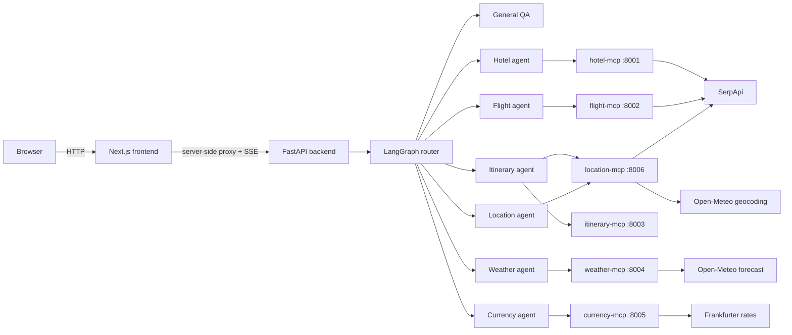

# TripWeaver

TripWeaver is an intent-routed, multi-agent travel planning application. A
Next.js workspace streams responses from a FastAPI and LangGraph backend. Each
travel capability is isolated behind its own Model Context Protocol (MCP)
service, so agents receive only the tools they are allowed to call.

The application supports flight and hotel search, itinerary construction,
weather forecasts, currency conversion, location resolution, and local place
search. Booking tools are demonstrations only; TripWeaver never purchases or
reserves travel.

## Documentation

- [System architecture](./SYSTEM.md)
- [MCP setup and provider contracts](./MCP_SETUP.md)
- [Security model](./SECURITY.md)
- [Production deployment](./DEPLOYMENT.md)
- [Bootcamp Vercel + Render + Supabase deployment](./BOOTCAMP_DEPLOYMENT.md)
- [Frontend guide](./frontend/README.md)

## Architecture



The repository contains the full eight-service topology: the frontend, the
backend, and six MCP servers. For the bootcamp demo, the backend can also run
provider tools in-process with `TRIPWEAVER_TOOL_MODE=local`, which fits the
Vercel, Render, and Supabase demo path without standing up six extra web
services. The backend is the only service that talks to OpenAI. The browser
receives no OpenAI, SerpApi, database, or backend API secrets.

## Capabilities

| Capability | Agent tools | Provider |
| --- | --- | --- |
| Hotels | `list_hotels`, `search_hotels`, `book_hotel` | SerpApi Google Hotels |
| Flights | `list_flights`, `search_flights`, `book_flight` | SerpApi Google Flights |
| Itinerary | `create_itinerary` | Deterministic local planner |
| Weather | `get_current_weather`, `get_weather_forecast` | Open-Meteo |
| Currency | `convert_currency`, `get_exchange_rate`, `list_supported_currencies` | Frankfurter |
| Location | `resolve_location`, `search_places` | Open-Meteo and SerpApi Google Maps |

The frontend renders typed result views for flights, hotels, itineraries,
weather, currency, and locations. It also includes guest conversation history,
account-backed history for signed-in travellers, search, export/share,
attachments, speech input where supported, trip context, quick actions,
settings, responsive mobile sheets, and live service/tool state.

## Repository layout

```text
backend/
  agents/                 LangGraph state, routing, prompts, specialists, MCP adapter
  api/                    FastAPI routes, schemas, and SSE normalization
  core/                   auth, account storage, validation, and rate limiting
  tests/                  backend unit and contract tests
frontend/
  app/                    Next.js routes and server-side API proxies
  components/             shadcn/ui and TripWeaver workspace components
  features/tripweaver/    stream reducer, conversations, trip context, types
  lib/                    shared helpers, including optional Supabase clients
mcp_servers/
  hotel_mcp/              SerpApi Google Hotels adapter
  flight_mcp/             SerpApi Google Flights adapter
  itinerary_mcp/          deterministic structured itinerary planner
  weather_mcp/            Open-Meteo weather adapter
  currency_mcp/           Frankfurter exchange-rate adapter
  location_mcp/           geocoding and SerpApi place search
deploy/render/            single-service Render backend image for demos
docker-compose.yml        local eight-service topology
render.yaml               Render Blueprint for the bootcamp backend
```

## Local setup

### 1. Install dependencies

PowerShell commands are shown below. Python 3.11 or later and Node.js 22 or
later are recommended.

```powershell
python -m venv .venv
.\.venv\Scripts\Activate.ps1

python -m pip install -r backend\requirements.txt
python -m pip install -r backend\requirements-dev.txt
python -m pip install -r mcp_servers\hotel_mcp\requirements.txt
python -m pip install -r mcp_servers\flight_mcp\requirements.txt
python -m pip install -r mcp_servers\itinerary_mcp\requirements.txt
python -m pip install -r mcp_servers\weather_mcp\requirements.txt
python -m pip install -r mcp_servers\currency_mcp\requirements.txt
python -m pip install -r mcp_servers\location_mcp\requirements.txt

npm ci --prefix frontend
```

### 2. Configure private environment files

Copy each example to `.env`. Never commit the resulting files.

```powershell
Copy-Item backend\.env.example backend\.env
Copy-Item frontend\.env.example frontend\.env
Copy-Item mcp_servers\hotel_mcp\.env.example mcp_servers\hotel_mcp\.env
Copy-Item mcp_servers\flight_mcp\.env.example mcp_servers\flight_mcp\.env
Copy-Item mcp_servers\location_mcp\.env.example mcp_servers\location_mcp\.env
```

Set these private values:

- `OPENAI_API_KEY` in `backend/.env`.
- The same `SERPAPI_API_KEY` in the hotel, flight, and location MCP `.env`
  files.
- A long random value in backend `TRIPWEAVER_API_KEYS` and the matching value
  in frontend `BACKEND_API_KEY` for authenticated local or production use.
- Optional `TRIPWEAVER_DB_PATH` in `backend/.env` for local account-backed
  history. It defaults to a local SQLite file under `backend/data`.
- Optional `DATABASE_URL` in `backend/.env` or Render for Supabase/Postgres
  account history. When set, it takes precedence over `TRIPWEAVER_DB_PATH`.
- Optional `NEXT_PUBLIC_SUPABASE_URL` and
  `NEXT_PUBLIC_SUPABASE_PUBLISHABLE_KEY` in `frontend/.env` or Vercel when
  using Supabase browser/SSR helpers. These are publishable values, not the
  private database URL.

The itinerary, weather, and currency services do not require API keys. See
[MCP_SETUP.md](./MCP_SETUP.md) for complete provider settings.

### 3. Start the services

Open one terminal for each process from the repository root:

```powershell
.\.venv\Scripts\python.exe mcp_servers\hotel_mcp\server.py
.\.venv\Scripts\python.exe mcp_servers\flight_mcp\server.py
.\.venv\Scripts\python.exe mcp_servers\itinerary_mcp\server.py
.\.venv\Scripts\python.exe mcp_servers\weather_mcp\server.py
.\.venv\Scripts\python.exe mcp_servers\currency_mcp\server.py
.\.venv\Scripts\python.exe mcp_servers\location_mcp\server.py
.\.venv\Scripts\python.exe -m uvicorn main:app --app-dir backend --port 8000
npm --prefix frontend run dev
```

Open:

- Application: http://localhost:3000
- Backend API docs: http://localhost:8000/docs
- Aggregated health: http://localhost:8000/health

The health response reports each MCP server independently. An available health
endpoint means the process is reachable; a provider-backed search can still
fail when its API key, quota, or upstream provider is unavailable.

### Docker Compose

After the same `.env` files exist, start the complete topology with:

```powershell
docker compose up --build
```

Each service has its own `Dockerfile`. The single-VM production topology in
[DEPLOYMENT.md](./DEPLOYMENT.md) keeps MCP services private, persists account
history, and replaces the earlier Railway-oriented deployment path.

### Bootcamp Vercel + Render + Supabase

For a zero-payment demo deployment, use
[BOOTCAMP_DEPLOYMENT.md](./BOOTCAMP_DEPLOYMENT.md). That path deploys the
Next.js frontend to Vercel, a single FastAPI backend to Render Free, and user
history to Supabase Postgres. The Render backend uses `TRIPWEAVER_TOOL_MODE=local`
so the travel tools run inside one service.

## Verification

The provider tests mock HTTP responses and do not spend SerpApi credits.

```powershell
.\.venv\Scripts\python.exe -m compileall backend mcp_servers frontend
.\.venv\Scripts\python.exe -m pytest -q

Push-Location backend
..\.venv\Scripts\python.exe -m pytest -q
Pop-Location

npm --prefix frontend test
npm --prefix frontend run lint
npm --prefix frontend run typecheck
npm --prefix frontend run build
```

## Demo checklist

Before calling the project finished, run through the deployed Vercel and Render
demo with two accounts:

- Register with email/password, sign out, sign back in, and confirm the user
  menu shows the right traveller.
- Sign in with Google and confirm the app returns to TripWeaver with the account
  loaded instead of showing an account-service error.
- Create two different accounts and confirm each account sees only its own
  conversations and plan folders.
- Create a chat, rename it, pin and unpin it, move it into a plan folder, move
  it back to All chats, then delete it.
- Ask a budget question such as "I want to travel to Singapore for one week;
  how much money do I need?" and confirm TripWeaver asks one guided question at
  a time before producing the estimate.
- Ask a normal place question such as "Tell me about Singapore Zoo" and confirm
  no unrelated answer choices appear under the normal response.
- Test one future flight search, hotel search, itinerary request, weather
  request, currency conversion, and place search.
- Switch SOL/LUNA, resize to mobile width, and confirm history and tools open as
  sheets while the chat remains usable.

## Production boundaries

- LangGraph memory and rate limiting are in process. Account history uses
  SQLite for local/dev and can use Supabase/Postgres through `DATABASE_URL`.
  Use managed Postgres plus Redis-backed rate limits before horizontal scaling.
- `TRIPWEAVER_TOOL_MODE=local` is intended for the bootcamp/demo backend. The
  full production topology should keep provider clients behind isolated MCP
  services unless there is an explicit deployment reason to collapse them.
- `book_hotel` and `book_flight` return explicit simulated confirmations.
- Open-Meteo forecasts are limited to the provider's 16-day horizon.
- The itinerary planner accepts trips up to 21 days and uses only supplied,
  provider-backed activities as named recommendations.
- Frankfurter publishes a finite reference-currency set; unsupported currencies
  return a controlled error.
- Dependency ranges are not a deployment lock file. Produce and maintain exact
  deployment locks before a production release.

See [SYSTEM.md](./SYSTEM.md) for the request lifecycle, trust boundaries,
failure behavior, and extension points.
