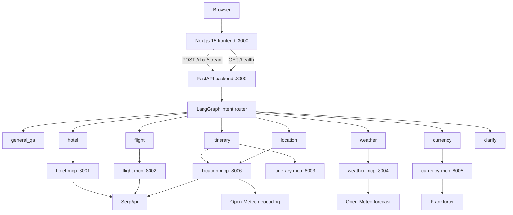

# TripWeaver system architecture

**Version:** 2.0

**Last reviewed:** 2026-07-14

**Runtime source of truth:** code and tests in this repository

This document describes the implemented system. When this document and the
runtime differ, the code and tests win and this document must be corrected.

## 1. Purpose and boundaries

TripWeaver is a conversational travel research and planning system. It routes a
traveller's message to a narrow agent, gives that agent only the MCP tools it
owns, streams progress to the browser, and renders provider results as typed UI
instead of relying only on model-generated prose.

Implemented capabilities:

- general travel questions
- live flight and hotel search through SerpApi
- structured itinerary construction
- current weather and forecasts through Open-Meteo
- current and historical reference-rate conversion through Frankfurter
- geocoding and local place search through Open-Meteo and SerpApi
- simulated hotel and flight booking confirmations

Explicit non-goals:

- real booking, ticketing, payment, or reservation changes
- guaranteeing provider availability, prices, or inventory
- autonomous actions outside the current conversation
- production horizontal scaling with the current in-memory state stores

## 2. Runtime topology



There are eight deployable processes. MCP services do not import backend agent
code, and backend agents do not import provider clients. HTTP plus MCP is the
boundary between them.

## 3. Layer responsibilities

### 3.1 Frontend

The frontend is a Next.js App Router application using React, TypeScript,
Tailwind CSS, shadcn/ui, Radix primitives, and Lucide icons.

Responsibilities:

- maintain browser-local conversations and user settings
- proxy chat and health calls from server routes so credentials stay server-side
- parse backend SSE into deterministic reducer state
- show agent and tool lifecycle status
- render flight, hotel, itinerary, weather, currency, and location payloads
- derive the trip context panel from the conversation and itinerary results
- provide quick actions, export/share, attachments, and optional speech input
- adapt history and status panels to sheets on small screens

`frontend/app/api/chat/route.ts` is the credential boundary. It reads
`BACKEND_API_KEY` on the Next.js server and sends `X-API-Key` to FastAPI. The
browser bundle never receives that value.

Conversation persistence is currently browser-local. Clearing browser storage
or using another device does not preserve history.

### 3.2 FastAPI HTTP layer

The backend exposes:

| Route | Purpose |
| --- | --- |
| `GET /health` | Backend state plus reachability of all six MCP health endpoints |
| `POST /session` | Generate a validated conversation session ID |
| `POST /chat/stream` | Run one graph turn and stream normalized SSE events |
| `GET /docs` | OpenAPI documentation |

The HTTP layer owns request validation, API-key authentication, CORS, rate
limiting, session IDs, user-safe error responses, and translation from
LangGraph events to the public SSE contract. It does not contain provider
request logic.

### 3.3 LangGraph orchestration

Every turn begins at `classify_intent`. The router model returns one value from
the `Intent` enum:

```text
general_qa | hotel | flight | itinerary | weather | currency | location |
clarify | end
```

A conditional edge dispatches to one node, and that node ends the turn. The
graph does not fan out to multiple specialists in parallel. The itinerary node
is the one exception to single-service ownership: it may use location search to
find candidate activities and then pass verified activity data to the
deterministic itinerary service.

The specialist execution loop:

1. Loads tools only from the node's configured MCP server set.
2. Binds those tools to the agent model.
3. Allows at most three model/tool rounds.
4. Records each invocation with its owning server and result status.
5. Fences tool output as untrusted data before returning it to the model.
6. Produces a final response or an honest service-unavailable response.

`MemorySaver` keeps conversation context by `session_id` while the backend
process remains alive. It is not durable and is not shared across replicas.

### 3.4 MCP adapter

`backend/agents/mcp_client.py` is the only backend module that knows MCP service
URLs. It owns:

- the six-server registry
- server-scoped tool discovery
- independent circuit breakers
- health probes
- controlled degradation when discovery fails

Tool loading uses:

```python
await MultiServerMCPClient.get_tools(server_name=server)
```

These connection-backed tools establish a fresh MCP connection when invoked.
Tools must not be returned from a temporary `ClientSession`, because they would
be bound to a closed stream after discovery exits.

Each circuit opens after three consecutive discovery failures and cools down
for 60 seconds. Breakers are process-local.

### 3.5 MCP services

Each service follows the same internal shape:

```text
FastMCP tool boundary -> input validation -> provider/domain client ->
normalization -> {ok: true, ...} or {ok: false, error: ...}
```

| Service | Tools | Data source |
| --- | --- | --- |
| `hotel-mcp` | `list_hotels`, `search_hotels`, `book_hotel` | SerpApi `google_hotels` |
| `flight-mcp` | `list_flights`, `search_flights`, `book_flight` | SerpApi `google_flights` |
| `itinerary-mcp` | `create_itinerary` | Deterministic domain logic |
| `weather-mcp` | `get_current_weather`, `get_weather_forecast` | Open-Meteo geocoding/forecast |
| `currency-mcp` | `convert_currency`, `get_exchange_rate`, `list_supported_currencies` | Frankfurter |
| `location-mcp` | `resolve_location`, `search_places` | Open-Meteo geocoding, SerpApi `google_maps` |

Provider response structures do not escape the MCP boundary. Each service
returns a normalized application contract and caps unbounded provider arrays.

## 4. Agent permissions

| Agent node | Allowed tools |
| --- | --- |
| General QA | None |
| Hotel | `hotel-mcp` only |
| Flight | `flight-mcp` only |
| Itinerary | `location-mcp`, `itinerary-mcp` |
| Weather | `weather-mcp` only |
| Currency | `currency-mcp` only |
| Location | `location-mcp` only |
| Clarify | None |

Permission is enforced by which tools are bound to each model. Prompt text is
an additional instruction, not the security boundary.

## 5. Request lifecycle

1. The browser posts `{message, session_id?}` to Next.js `/api/chat`.
2. Next.js forwards the request to backend `/chat/stream` with the server-only
   API key.
3. FastAPI authenticates, rate-limits, sanitizes the message, and validates or
   creates a session ID.
4. FastAPI starts `graph.astream_events` with the session ID as LangGraph's
   thread ID.
5. The router chooses one downstream node.
6. A specialist discovers only its MCP tools and the model selects any calls.
7. The MCP service validates input, calls its provider if needed, and normalizes
   the result.
8. The specialist fences the tool result before the model sees it.
9. The SSE adapter emits lifecycle, structured result, and response-token events.
10. The frontend reducer updates one assistant message, service state, tool
    activity, trip context, and typed result components.

An upstream exception becomes a user-safe `error` event followed by `done`.
Internal URLs, stack traces, provider bodies, and credentials are not sent to
the browser.

## 6. Public SSE contract

Every event is encoded as one JSON object in an SSE `data:` frame.

| Type | Important fields | Meaning |
| --- | --- | --- |
| `session` | `session_id` | Stable thread identity |
| `status` | `state`, `node` | Router/agent activity |
| `tool` | `tool`, `status` | `INVOKED`, `SUCCEEDED`, or `FAILED` |
| `result` | `result_type`, `tool`, `data` | Typed provider/domain result |
| `token` | `content` | Assistant text fragment |
| `error` | `message` | User-safe failure |
| `done` | none | End of stream |

Result types are `flight`, `hotel`, `itinerary`, `weather`, `currency`, and
`location`. The frontend never parses provider data out of assistant prose.

## 7. State model

`TripWeaverState` is the graph's shared schema. It contains:

- append-only LangChain messages
- intent, active agent, and activity
- missing-field and clarification data
- hotel/flight result and simulated booking fields retained for graph-level use
- normalized tool-call records
- session identity

Structured UI results are emitted directly from successful MCP tool-end events.
This avoids duplicating large provider payloads in graph state while preserving
typed frontend data.

## 8. Security and trust boundaries

### Secrets

- `OPENAI_API_KEY` exists only in the backend environment.
- `SERPAPI_API_KEY` exists only in hotel, flight, and location MCP environments.
- `TRIPWEAVER_API_KEYS` exists only in the backend.
- A matching `BACKEND_API_KEY` exists only in the Next.js server environment.
- `.env` files are ignored and Docker build contexts exclude them.
- Provider errors are sanitized and keys are never intentionally logged.

### Untrusted tool output

MCP data can contain hostile or accidental instruction-like text. Before a tool
result re-enters an LLM conversation, the backend serializes it as canonical
text and wraps it in `<tool_data>` boundaries. Every specialist prompt states
that this content is data, not an instruction.

This reduces indirect prompt-injection risk but does not make provider data
trusted. Rendering and booking decisions still require validation and user
confirmation.

### HTTP controls

- optional API-key authentication for local development, required in production
- CORS allow-list
- message length validation and sanitization
- session ID validation
- process-local fixed-window rate limiting
- user-safe errors with server-side detailed logging

See [SECURITY.md](./SECURITY.md) for the threat model and deployment checklist.

## 9. Resilience behavior

- Health checks are independent of tool execution.
- One unavailable MCP removes only that specialist's live tools.
- Discovery failures increment only that server's circuit breaker.
- Provider timeouts and non-success responses become controlled tool failures.
- Missing provider arrays normalize to empty results.
- `ok: false` is surfaced as a failed tool event even when MCP transport succeeds.
- The frontend preserves the conversation and displays a request failure state
  when a stream ends with an error.

An `available` health status means a process answered `/health`; it does not
guarantee OpenAI quota, SerpApi quota, credentials, or external provider uptime.

## 10. Environment contract

### Backend

| Variable | Purpose |
| --- | --- |
| `OPENAI_API_KEY` | OpenAI authentication |
| `ROUTER_MODEL`, `AGENT_MODEL` | Model selection |
| `HOTEL_MCP_URL` | Hotel MCP `/mcp` URL |
| `FLIGHT_MCP_URL` | Flight MCP `/mcp` URL |
| `ITINERARY_MCP_URL` | Itinerary MCP `/mcp` URL |
| `WEATHER_MCP_URL` | Weather MCP `/mcp` URL |
| `CURRENCY_MCP_URL` | Currency MCP `/mcp` URL |
| `LOCATION_MCP_URL` | Location MCP `/mcp` URL |
| `TRIPWEAVER_API_KEYS` | Comma-separated accepted API keys |
| `ALLOWED_ORIGINS` | Comma-separated browser origins |
| `RATE_LIMIT_REQUESTS` | Requests allowed per local window |
| `RATE_LIMIT_WINDOW_SECONDS` | Local rate-limit window |
| `MAX_MESSAGE_LENGTH` | Sanitized user-message cap |

### Frontend

| Variable | Purpose |
| --- | --- |
| `BACKEND_URL` | FastAPI base URL |
| `BACKEND_API_KEY` | One value accepted by `TRIPWEAVER_API_KEYS` |
| `PORT` | Frontend process port |

### MCP services

| Variable | Services |
| --- | --- |
| `SERPAPI_API_KEY`, `SERPAPI_BASE_URL` | Hotel, flight, location |
| `OPEN_METEO_GEOCODING_URL` | Weather, location |
| `OPEN_METEO_FORECAST_URL` | Weather |
| `FRANKFURTER_BASE_URL` | Currency |
| `PORT` | Every MCP service |

Detailed examples are in [MCP_SETUP.md](./MCP_SETUP.md).

## 11. Testing strategy

Tests are separated by ownership boundary:

- provider unit/contract tests use mocked HTTP transports
- itinerary domain tests validate deterministic scheduling and input rules
- MCP tests validate normalized results and safe failures
- backend tests cover routing, tool scoping, content-block normalization,
  circuit breakers, authentication, rate limiting, health, and SSE mapping
- frontend tests cover API proxies, conversations, context extraction, SSE
  reduction, structured result rendering, and workspace interactions
- build-context tests ensure secrets are not copied into Docker images

Live API calls are manual verification only. Automated tests must not consume
SerpApi credits or depend on OpenAI/provider availability.

Required release checks are documented in [README.md](./README.md).

## 12. Design decisions

| Decision | Rationale |
| --- | --- |
| Intent router plus narrow specialists | Keeps prompts, tools, and failures bounded by capability |
| One process per MCP capability | Independent deployment, health, credentials, and replacement |
| Server-scoped tool binding | Enforces least privilege by construction |
| Connection-backed MCP tools | Keeps invocation sessions alive for the duration of each call |
| Structured result SSE | Gives the UI typed data without parsing assistant prose |
| Deterministic itinerary planner | Prevents invented scheduling and makes output testable |
| Open-Meteo for weather/geocoding | Keyless provider with clear HTTP contracts |
| Frankfurter for currency | Simple current/historical reference-rate API |
| SerpApi for travel/place search | Common normalized access to Google result engines |
| Simulated booking only | Avoids payments, irreversible actions, and false reservation claims |
| In-memory checkpointer/rate limiter for now | Simple local topology; replacement is required before multi-instance scale |

## 13. Known limitations and production work

1. OpenAI responses require an active key with available project quota. Service
   health can be green while chat returns an OpenAI quota error.
2. SerpApi searches require a valid key and spend account credits.
3. Frankfurter supports only its published currency list. Unsupported currencies
   such as LKR can return a controlled error.
4. Open-Meteo forecasts are limited to 16 days.
5. Itineraries are limited to 21 days and do not optimize routes or travel time.
6. A turn routes to one specialist; a combined flight/hotel/weather itinerary
   orchestration node is not implemented.
7. Conversation memory, rate limiting, and circuit state are process-local.
8. The frontend has no account-backed cross-device history.
9. Booking is simulated and intentionally cannot transact.
10. Python dependencies use bounded minimum ranges rather than a committed lock
    artifact. Production deployments should use reviewed exact locks.
11. Observability is application logging and health checks; distributed traces,
    metrics, alerting, and provider SLO dashboards remain production work.

Recommended next production steps:

1. Move checkpointer, rate limiting, and circuit state to shared durable stores.
2. Add CI gates for Python/frontend tests, lint, type checks, builds, and secret
   scanning.
3. Add OpenTelemetry traces and metrics around graph, LLM, MCP, and provider calls.
4. Add account authentication and server-side conversation persistence.
5. Pin and automate dependency updates with reproducible lock artifacts.
6. Add a deliberate multi-capability planning workflow with bounded parallelism.

## 14. Extension rules

To add or replace a provider without weakening the architecture:

1. Keep provider-specific authentication and response parsing inside its MCP
   service.
2. Normalize data before returning it over MCP.
3. Validate all input before making a billable request.
4. Use explicit timeouts and controlled errors.
5. Redact credentials and avoid logging full provider URLs.
6. Register the service centrally and bind it only to intended agents.
7. Add structured SSE/frontend mappings when the result is user-facing.
8. Add offline tests at every changed boundary.
9. Update Compose, environment examples, and this document.
